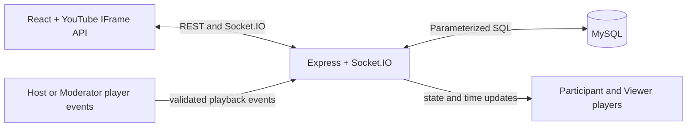

# VibeRoom

VibeRoom is a YouTube watch-party application. A Host creates a room and controls the video; Moderators can also control playback and handle requests. Participants and Viewers watch, chat, and may request supported playback actions.

## Features

- Room creation with a unique six-character code and invite links
- Host, Moderator, Participant, and Viewer roles
- Synchronized YouTube video, play/pause, and seek state
- Host/Moderator approval for participant playback requests
- Participant list, role assignment, removal, and Host transfer
- Room-scoped chat
- MySQL-backed rooms, memberships, roles, and current video state
- Socket.IO reconnect and late-join state synchronization

## Architecture



Vite serves the React client during development and proxies `/api` and `/socket.io` to Express. In production, Vite builds the client into `public`, which Express serves from the same origin by default. `client/src/socket.js` owns the Socket.IO connection and REST helpers. `RoomPage` joins and reconnects to a room, while `YoutubePlayer` translates YouTube IFrame API state into validated socket events and applies server updates to other players.

The server verifies the guest JWT and room membership when a socket joins. Playback and management handlers check the role held in the database-backed room membership; client-side disabled controls are only a usability layer. Approved requests are stored server-side, validated, and executed without changing the requester’s role.

## Project Structure

```text
youtube-watch-party/
  auth.js                    JWT signing and middleware
  db.js                      MySQL connection pool
  migrate.js                 Additive schema setup
  server.js                  Express routes, Socket.IO, room state
  routes/rooms.js            Room and participant REST endpoints
  public/                    Production client output and static files
  client/
    src/App.jsx               Lobby-to-room session flow
    src/pages/                JoinPage.jsx, RoomPage.jsx
    src/components/           Chat, ConfirmDialog, ParticipantsList,
                              RequestPanel, YoutubePlayer
    src/socket.js             REST and Socket.IO client
    vite.config.js            Dev proxy and production build output
```

## Requirements

- Node.js 20.19+ or 22.12+
- MySQL 8+ (local or hosted)
- npm

## Local Setup

From PowerShell in the repository root:

```powershell
npm install
npm --prefix client install
Copy-Item .env.example .env
```

Edit `.env` with the database connection details. Replace the JWT placeholder with a unique secret; for example, generate one locally with:

```powershell
node -e "console.log(require('crypto').randomBytes(32).toString('hex'))"
```

Create the database if it does not already exist:

```sql
CREATE DATABASE watchparty CHARACTER SET utf8mb4 COLLATE utf8mb4_unicode_ci;
```

Run the additive migration. It creates missing tables and does not drop or clear existing data:

```powershell
npm run migrate
```

Run both services together with `npm run dev`, or use separate terminals:

```powershell
# Repository root: API and Socket.IO on port 3000
npm start
```

```powershell
# Client directory: Vite on port 5173
Set-Location client
npm run dev -- --host localhost --port 5173
```

Open `http://localhost:5173`. If that port is busy, choose an available Vite port such as `5175` and update `CLIENT_ORIGIN` to that exact origin. The Vite proxy defaults to `http://localhost:3000`.

Build the production client with:

```powershell
npm run build
```

The build writes to `public` and intentionally does not empty that directory, preserving other static files. Express serves the built application and API from port `3000` by default.

## Environment Variables

Backend values belong in the repository-root `.env` file and must not be committed.

| Variable | Purpose |
| --- | --- |
| `PORT` | Express and Socket.IO port; defaults to `3000` |
| `DB_HOST` | MySQL host |
| `DB_PORT` | MySQL port; defaults to `3306` |
| `DB_NAME` | Database name; example uses `watchparty` |
| `DB_USER` | MySQL user |
| `DB_PASS` | MySQL password |
| `JWT_SECRET` | Unique signing secret; required, with no insecure fallback |
| `CLIENT_ORIGIN` | Allowed frontend origin(s) for cross-origin access; comma-separate multiple origins |

Optional Vite variables belong in `client/.env` or the frontend build environment. See `client/.env.example`.

| Variable | Purpose |
| --- | --- |
| `VITE_API_BASE_URL` | Backend origin for a separately hosted frontend; blank uses the current origin |
| `VITE_API_PROXY_TARGET` | Development proxy target; defaults to `http://localhost:3000` |

`VITE_` variables are included in browser code. Never put database credentials or `JWT_SECRET` in them.

## Roles and Requests

| Permission | Host | Moderator | Participant / Viewer |
| --- | --- | --- | --- |
| Play, pause, seek, change video | Yes | Yes | Request only |
| Approve/reject playback requests | Yes | Yes | No |
| Assign roles | Yes | No | No |
| Remove participants | Yes | Viewers/Participants only | No |
| Transfer Host | Yes | No | No |
| Chat | Yes | Yes | Yes |

New members join as Viewers. The room creator is assigned Host in the room-creation transaction. A Host may promote a member to Moderator. An approved request performs only that validated action; it never promotes the requester. Removed users are recorded in `room_bans` and the room join endpoint rejects them.

## Socket.IO Flow

- `join-room`: verifies the signed token and persisted room membership, then sends `room-state` and the participant list.
- `playback:play`, `playback:pause`, `playback:seek`, and `playback:changeVideo`: accepted only from Host/Moderator sockets, update persisted room state, and broadcast to the room.
- `video-state`: periodic Host/Moderator time snapshots correct drift and support reconnects; buffering samples are skipped.
- `request:action` / `request:respond`: the server records a pending request, sends it only to Host/Moderators, validates the response against that record, then applies the approved action.
- `role:assign`, `participant:remove`, and `host:transfer`: role-checked management events update database membership and notify connected clients.
- `room-chat`: carries real user messages. Join/leave status notices are marked as system events and are excluded from chat history.

## Database and Runtime State

- `users`: guest display names and the latest socket ID.
- `rooms`: unique room code, Host, video ID/title, playing flag, and last playback time.
- `room_participants`: per-room membership and role, unique on `(room_id, user_id)`.
- `room_events`: role, removal, and Host-transfer audit events.
- `room_bans`: removed users, unique per room/user; foreign-key cascades apply only when a room or user is deleted.

Room, participant, role, and video state persist in MySQL. The server interpolates the current playing time in an in-memory timer and falls back to the persisted update timestamp after restart. Pending approvals and chat history are in memory and are not retained across server restarts. There is no automatic room/user cleanup endpoint. A single server instance is expected; horizontal scaling needs a Socket.IO adapter and shared timer/request state.

## Deployment Preparation

A single Node web service on Render or Railway is the simplest deployment: it serves the built React app, REST API, and Socket.IO from one origin.

1. Provision a MySQL database and a Node web service.
2. Use build command `npm ci && npm ci --prefix client && npm run build`.
3. Use start command `npm start`.
4. Set `PORT`, `DB_HOST`, `DB_PORT`, `DB_NAME`, `DB_USER`, `DB_PASS`, and a newly generated `JWT_SECRET` in the service environment.
5. Run `npm run migrate` once against the hosted database using the provider’s shell or release command.
6. Verify `/health` and test a room from two browser sessions. Confirm the host, frontend origin, and Socket.IO WebSocket connection match the deployment configuration.

For a separately hosted frontend, set `VITE_API_BASE_URL` to the backend origin at build time and set backend `CLIENT_ORIGIN` to the frontend origin. Keep HTTPS on both origins. Do not deploy with the `.env.example` JWT placeholder. No public deployment has been performed or verified.

**Live URL:** Not deployed. Replace this line with the verified service URL after deployment.

## Validation

The client provides `npm run lint` and `npm run build`. The repository currently has no automated test files or backend test script. The backend can be syntax-checked with `node --check server.js`, `node --check auth.js`, `node --check routes/rooms.js`, and `node --check migrate.js`. Complete room, role, playback, request, and reconnect verification in separate Host and Viewer sessions before release.

## Limitations

YouTube playback depends on each video allowing embedding and on browser autoplay policy. Chat and pending requests are not persistent. The in-memory timer and request queue require a single backend instance until a shared store/Socket.IO adapter is added. Room data is not automatically expired or deleted.
